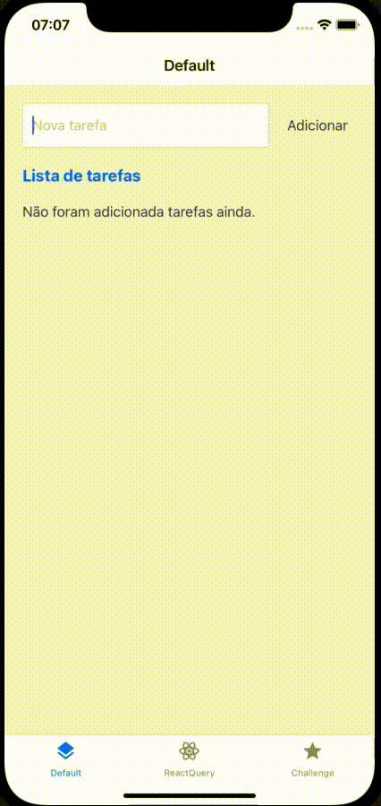

# Spartalk React Query

This project was a used to on Spartalk (a tech talk on Spartlabs) to introduce React Query Lib.
It compares a default and casual list vs a React Query list of totos items.



## Table of Contents

- [Installation](#installation)
- [Run](#usage)

## Installation

Download the project and follow the steps above:

Install dependences

```sh
yarn
```

#### Install Pods (Only iOS)

```sh
npx pod-install
```

## Run

For iOS

```sh
yarn ios
```

For Android

```sh
yarn android
```